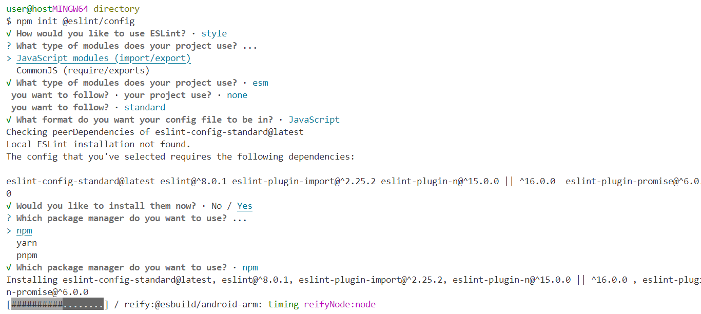

# Exercice 1 : création formulaire d'inscription

---

## Modalités

- **Ne modifiez pas le HTML ou CSS directement**.
- **Debuggez votre code depuis à l'aide de l'extension live server de Visual Studio Code**
- **Utilisez les CustomElement**

---

## Enoncé

1. Créez un formulaire d'inscription en reprennant le modèle fournit depuis le fichier ***src/html/_partials/sign-up.html*** et en implémentant les scénarios suivants.

---

## Scénario 1

En tant qu'utilisateur ;
Lorsque je suis sur la page d'accueil (connexion) ;
Et que je demande à m'inscrire ;
Alors, je devrais voir les champs suivants à la place du formulaire de connexion ;
- Nom
- Prénom
- Email
- Mot de passe
- Confirmer le mot de passe
- Age
- Pays
- Ville

---

## Scénario 2

En tant qu'utilisateur ;
Lorsque je suis sur la page d'inscription ;
Et que je demande à me connecter ;
Alors, je devrais voir les champs suivants à la place du formulaire d'inscription ;
- Email
- Mot de passe

---

## Bonus 1

1. Installez et configurer le module Eslint.
Un outil d'analyse statique (sans execution du code) pour vérifier les erreurs dans son code et s'assurer une meilleure qualité du code grâce à la vérification des bonnes pratiques du langage depuis un fichier de configuration.

- Vous effectuez la configuration d'ESLINT depuis le terminal et la racine de votre projet, copiez/collez la commande suivante : `npm init @eslint/config` et laissez-vous guider et faites vos choix pour la suite (cf. illustration ci-dessous).
- Ajoutez un script dans le fichier package.json dédié aux vérifications d'ESLint  et un autre pour corriger toutes les erreurs et warning.
Appuyez-vous sur cette [documentation](https://eslint.org/docs/latest/use/command-line-interface) 

---

## Illustration

### ESLINT config

---

## Bonus 2

1. Affichez également les messages d'aides pour le formulaire de connexion.