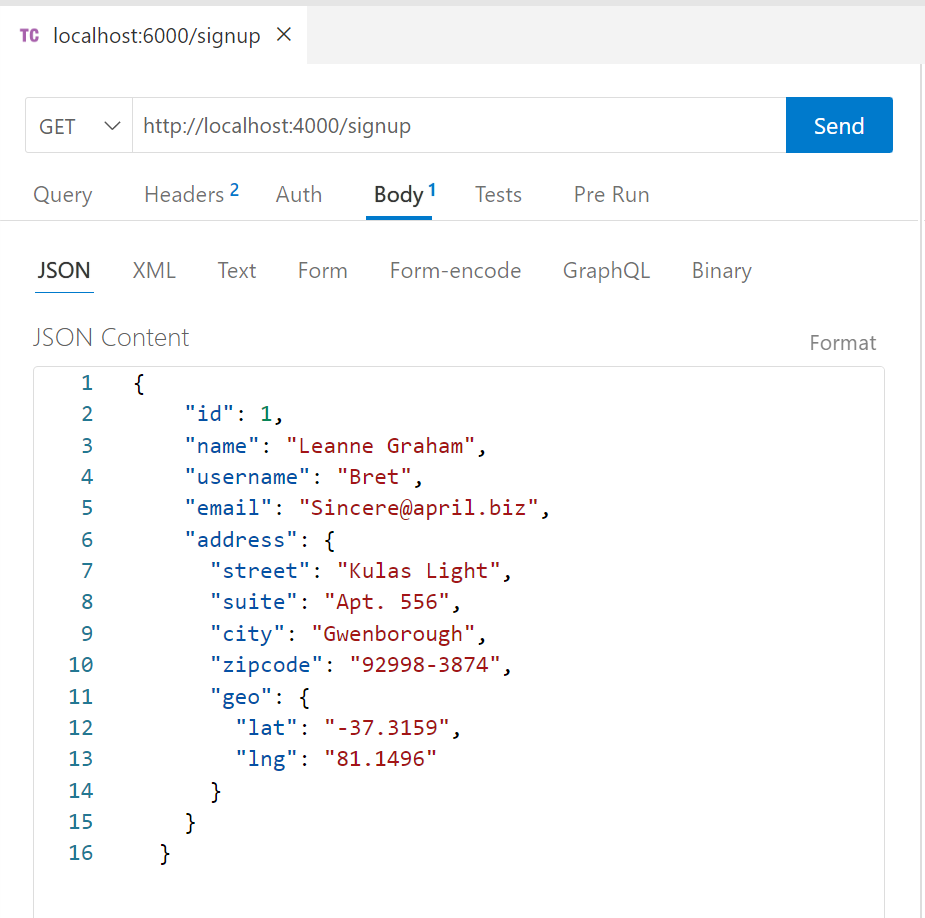

# Exercice 12 : gestion de l'inscription

---

## Enoncé

1. Gérez l'inscription d'un nouvel utilisateur depuis un client (*thunder client ou postman*).
2. Stockez les données envoyées par l'utilisateur au format *JSON* dans le fichier `data/users.json` (*le fichier se trouve dans un dossier data*).
Vous pouvez récupérez des faux utilisateurs via [https://jsonplaceholder.typicode.com/users](https://jsonplaceholder.typicode.com/users) (on inscrit un utilisateur à la fois donc dans le *body* de votre requête, vous devez avoir que des informations d'un seul utilisateur)

---

## Spécifications technique

1. Les données depuis le client doivent être envoyé au format *JSON*.
- Effectuez vos tests via `postman` ou `l'extension thunder client`.
- La donnée doit être au format *JSON* et contenir les informations suivantes 

`{
    "id": 1,
    "name": "Leanne Graham",
    "username": "Bret",
    "email": "Sincere@april.biz",
    "address": {
      "street": "Kulas Light",
      "suite": "Apt. 556",
      "city": "Gwenborough",
      "zipcode": "92998-3874",
      "geo": {
        "lat": "-37.3159",
        "lng": "81.1496"
      }
    }
  }
`

###### Postman

###### Thunder client

2. Caractéristiques du serveur back-end :
- Écoute sur le port `5000` ;
- Méthode `POST` ;
- URL `/signup` ;
3. Le dossier `data` et le fichier `users.json` doivent être créer depuis votre programme. Pour cela :
- Créez une fonction qui vérifie qu'un fichier ou un dossier existe ;
- Créez une fonction dédiée à la création d'un fichier avec du contenu ;
- Créez une fonction dédiée à la lecture des données d'un fichier ;
- Si l'utilisateur existe déja dans le fichier `data/users.json`, le serveur doit répondre au format *JSON*  `{"message": "user already exists"}` avec un status `200`.
- Si tout s'est bien déroulé, le serveur répond au format *JSON* `{"message": "user created"}` avec un status `201`.
- Dans tous les autres cas, retournez une erreur `500`.