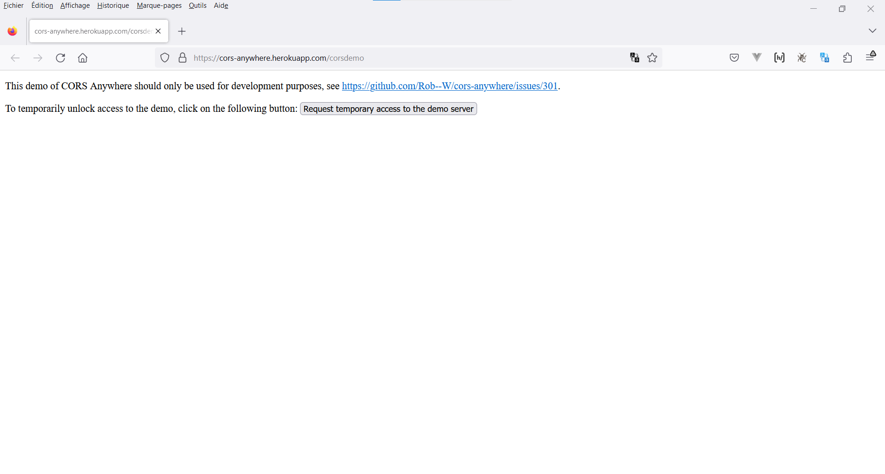
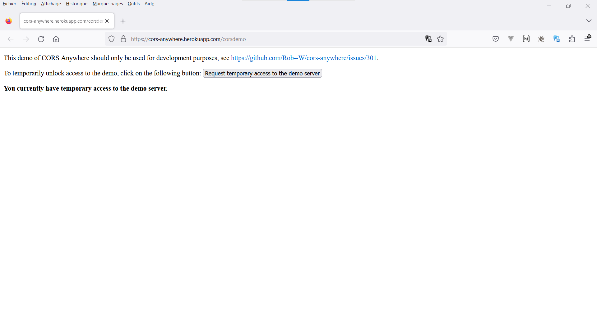

# Exercice 2 : asynchrones

---

## Enoncé

1. Créez la page `news.html` en répondant aux scénarios de cas d'utilisation ci-après.

---

## Scénario 1

En tant qu'utilisateur ;

Lorsque, je suis sur la page d'actualité ;

Alors, je devrais voir la météo du jour (température) en fonction de la latitude et longitude d'une ville choisie au hasard (plus tard, ça sera la ville choisie lors de l'inscription).

### Spécifications techniques du scénario 1

- [Documentation de l'API open-meteo pour récupérer la météo d'une ville](https://open-meteo.com/en/docs#api_form)

---

## Scénario 2

En tant qu'utilisateur ;

Lorsque, je suis sur la page d'actualité ;

Alors, je devrais voir des articles composés de : 
- Un titre ;
- Une image de couverture ;
- Un lien hypertexte vers l'article depuis sa source ;
- L'auteur ; 
- La date de publication ;

### Spécifications techniques du scénario 2

- La page d'actualité se nomme `news.html`.
- Vous devez utiliser le template HTML (modèle) d'un article fournit dans les ressources  depuis le dossier `src/html/_paritals/article.html` que vous avez récupéré pour l'exercice 1.
- Utilisez le flux RSS de `France 24` pour récupérer les actualités depuis le lien [https://cors-anywhere.herokuapp.com/https://api.factmaven.com/xml-to-json?xml=https://www.france24.com/fr/rss](https://cors-anywhere.herokuapp.com/https://api.factmaven.com/xml-to-json?xml=https://www.france24.com/fr/rss).

Vous devez absolument autoriser les appels externes avec le proxy `cors-anywhere`, depuis le réseau (devTools), cliquez sur la requête concernée puis cliquez sur le bouton `Request temporary access to the demo server`. Vous pouvez vous appuyer sur les illustrations ci-dessous.

Petite explication sur le lien : 

- La première partie du lien nous permet d'effectuer une requête sans blocage du navigateur dans notre environnement de développement cf [HTTP CORS](https://developer.mozilla.org/fr/docs/Glossary/CORS) ;

- La deuxième partie permet de transformer le résultat reçu du XML en JSON (plus facile à manipuler) des informations que l'on souhaite traiter.

## Illustrations

---

## Scénario 3

En tant qu'utilisateur ;

Lorsque, je demande à visualiser le contenu textuel d'un article ;

Alors, je devrais voir le contenu textuel (description), l'image et le titre de l'article apparaitre au premier plan de la page d'actualité.

### Spécifications techniques du scénario 3

- Proposez un bouton pour ouvrir une modale permettant d'afficher les informations (titre, image et description) lorsque l'utilisateur clique sur le bouton dédié à cet action depuis le template HTML fournit.
- Proposez un bouton de fermeture qui permet de fermer la modale du premier plan de notre page.
- Le `CSS` spécifique à la gestion des modales est dejà inclus dans la feuille de style principale `main.css`.

---

## Bonus 1

1. Récupérez en plus des news de france24 ceux des URL suivants et les afficher dans la page de news :
- [https://www.mediapart.fr/articles/feed](https://www.mediapart.fr/articles/feed) ;
- [http://javascriptweekly.com/rss](http://javascriptweekly.com/rss) ;
- [http://www.thecrazyprogrammer.com/feed](http://www.thecrazyprogrammer.com/feed) ;
- [https://www.tutorialandexample.com/feed/](https://www.tutorialandexample.com/feed/) ;

2. Affichez un loader avant le chargement des articles

---

## Bonus 2

- Utilisez [Promise.all](https://developer.mozilla.org/fr/docs/Web/JavaScript/Reference/Global_Objects/Promise/all)

---

## Bonus exercice 3

- Remplace l'âge par la date de naissance à l'aide de javascript sans modifier le HTML.
- Ajoutez une option supplémentaire "Sélectionnez un pays" qui doit être affiché dans la sélection au moment de la récupération des pays.
- Utilisez directement l' API *Country State City* via sa documentation sur le lien [https://countrystatecity.in/docs/api/all-countries/](https://countrystatecity.in/docs/api/all-countries/) pour récupérer les pays.
- Utilisez directement l' API *Country State City* via sa documentation sur le lien [https://countrystatecity.in/docs/api/cities-by-country/](https://countrystatecity.in/docs/api/cities-by-country/) pour récupérer les villes d'un pays.